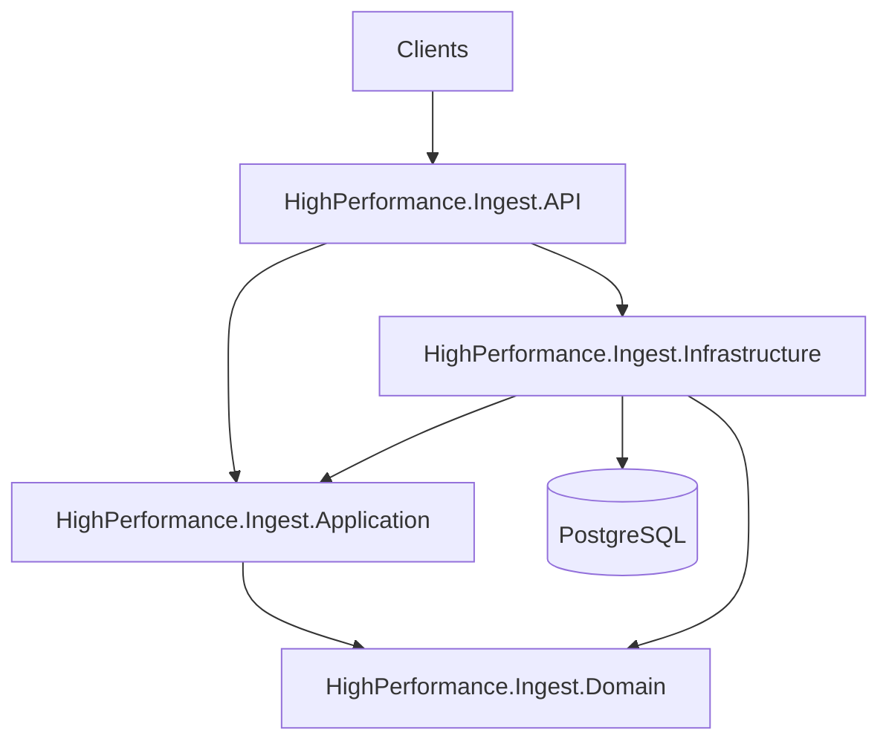
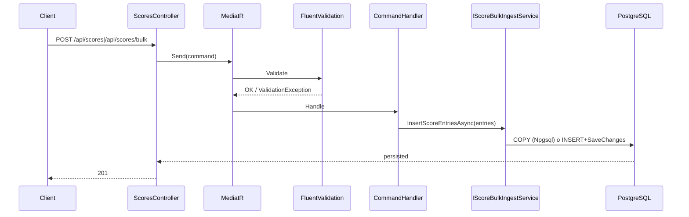
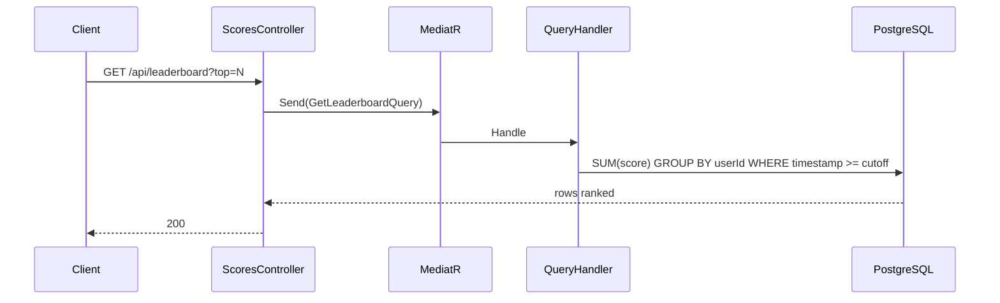

# SOLUTION.md

Documento técnico de la solución para el servicio de leaderboard global.

## 1) Arquitectura

La solución sigue una estructura de capas tipo Clean Architecture + CQRS/MediatR:

- `API`: hosting ASP.NET Core, controlador HTTP, swagger, exception handling.
- `Application`: comandos/queries, validaciones, DTOs, contratos.
- `Infrastructure`: EF Core, migraciones, implementación de persistencia y bulk ingest.
- `Domain`: entidad `ScoreEntry`.

### Componentes principales

- `ScoresController`:
  - `POST /api/scores`
  - `POST /api/scores/bulk`
  - `GET /api/leaderboard?top=N`
  - `GET /api/users/{id}/score`
- `RegisterScoreCommandHandler` y `RegisterScoresBulkCommandHandler`
- `GetLeaderboardQueryHandler` y `GetUserScoreQueryHandler`
- `ScoreBulkIngestService`
- `GlobalExceptionHandler`

## 2) Flujos de datos

### 2.1 Escritura (single y bulk)

### 2.2 Lectura de leaderboard / score por usuario

## 3) Modelo de datos y reglas de negocio

Tabla principal:

- `ScoreEntries(Id, UserId, Score, Timestamp, xmin)`
- Índice: `IX_ScoreEntries_UserId_Timestamp`

Reglas implementadas:

- `UserId` obligatorio.
- `Score >= 0`.
- `timestamp` opcional, pero si se envía debe traer zona horaria (ISO-8601 UTC/offset).
- Se rechaza `DateTimeKind.Unspecified`.
- Se normaliza a UTC antes de persistir.
- Ventana configurable en lectura con `LeaderboardSettings:WindowDays` (default 7).
- Tamaño máximo de batch en bulk: `LeaderboardSettings:MaxScoreBatchSize` (default 10000).

## 4) Trade-offs (compensaciones)

| Decisión | Ventaja | Costo/Trade-off |
|---|---|---|
| Append-only en writes | Reduce contención por hot user | Crece volumen de datos más rápido |
| Agregación en lectura (`SUM/GROUP BY`) | Consistencia directa sin jobs async | Carga en DB para queries de leaderboard |
| Bulk vía COPY en PostgreSQL | Alto throughput de ingestión | Camino específico por proveedor |
| CQRS + MediatR + validaciones | Separación clara y testabilidad | Mayor complejidad estructural |
| Ventana temporal configurable | Flexibilidad operativa | Cambios grandes de ventana impactan costo de query |

## 5) Latencia / throughput esperados y cuellos de botella

### Estado actual (single node, sin caché distribuida)

- `POST /api/scores`: p95 bajo, orientado a inserción simple.
- `POST /api/scores/bulk`: p95 depende de tamaño de batch.
- `GET /api/leaderboard`: p95 crece con cardinalidad de usuarios y ventana.
- `GET /api/users/{id}/score`: p95 mejor que leaderboard global por filtro directo.

### Cuellos de botella probables

1. Query de agregación global en `ScoreEntries` al crecer la ventana y datos.
2. Throughput de escritura en PostgreSQL bajo picos sostenidos.
3. Pool de conexiones de DB si aumenta concurrencia de API.
4. Contención de I/O en disco del nodo de DB.

## 6) Plan y cálculos para escalar a 100k req/s

Objetivo de capacidad:

- **Total:** 100,000 req/s
- Supuesto de distribución: **80% lecturas / 20% escrituras**
  - Lecturas: 80,000 req/s
  - Escrituras: 20,000 req/s

### Componentes a escalar

| Componente | Escalado propuesto |
|---|---|
| API | Horizontal (pods/instancias stateless) |
| PostgreSQL write path | Vertical + tuning + pool (PgBouncer) |
| PostgreSQL read path | Réplicas de lectura |
| Caché de lectura | Redis para leaderboard/top N |
| Almacenamiento | IOPS/throughput administrado acorde al write rate |

### Plan por capa

1. **API**: escalar horizontalmente (N instancias detrás de LB).
2. **DB writes**: mantener un primary optimizado para ingestión (COPY/batches).
3. **Reads**:
   - cache de leaderboard (TTL corto, por ejemplo 1-5s),
   - opcionalmente réplicas read-only para consultas agregadas.
4. **Connection pooling**: agregar PgBouncer para estabilizar conexiones.
5. **Particionamiento temporal** de `ScoreEntries` para mantener consultas acotadas.

### Cálculo orientativo de dimensionamiento (orden de magnitud)

- Si una instancia API maneja 2k-5k req/s (mezcla read/write), para 100k req/s se requieren ~20-50 instancias.
- Para 80k req/s de lectura:
  - con cache hit alto (>=90%), DB queda protegida y se evita que toda la carga llegue a agregaciones.
- Para 20k req/s de escritura:
  - usar batches/COPY reduce overhead por request.
  - requerirá tuning de WAL/checkpoints/autovacuum + almacenamiento alto IOPS.

> Nota: números exactos deben validarse con pruebas de carga en entorno parecido a producción.

## 7) Plan de despliegue

### Entornos

- Local/demo: `deploy/docker-compose.yml`
- Producción: contenedores en orquestador (Kubernetes o equivalente), DB administrada PostgreSQL.

### Pasos de despliegue

1. Build + test en CI.
2. Publicación de imagen versionada.
3. Despliegue rolling/blue-green del API.
4. Migraciones EF controladas (job separado) antes de enrutar tráfico nuevo.
5. Verificación de health checks y métricas.

## 8) Estrategia de despliegue y rollback

### Rollout recomendado

- Rolling update con porcentaje controlado.
- Readiness probes para no enrutar tráfico prematuramente.

### Rollback

1. Revertir versión de API al artefacto previo.
2. Mantener migraciones backward-compatible (expand/contract).
3. Si una migración rompe compatibilidad, rollback de app + plan de migración inversa controlada.

## 9) Plan de recuperación

- **Backups automáticos** de PostgreSQL (full + WAL/PITR).
- Definir objetivos operativos:
  - RPO objetivo (pérdida aceptable de datos)
  - RTO objetivo (tiempo de recuperación)
- Runbooks de incidentes:
  1. caída de API,
  2. degradación de DB,
  3. restauración desde backup,
  4. failover a réplica si aplica.

## 10) Estrategia de monitoreo

### Métricas mínimas

- API:
  - req/s por endpoint
  - p50/p95/p99 latencia
  - tasa de errores 4xx/5xx
- DB:
  - conexiones activas/espera
  - duración de queries (leaderboard)
  - TPS writes
  - CPU/IOPS/latencia disco
- Negocio:
  - scores ingeridos por minuto
  - usuarios únicos por ventana
  - tamaño promedio de batch bulk

### Alertas

- p99 de `GET /leaderboard` por encima de umbral.
- 5xx > umbral sostenido.
- saturación de pool/conexiones DB.
- lag de réplica (si existe read replica).

## 11) Consideraciones de seguridad

### Estado actual del código

- Actualmente **no hay autenticación/autorización activa**.
- Endpoints públicos.

### Recomendaciones de seguridad para producción

1. **Autenticación**: JWT/OIDC en gateway o API.
2. **Autorización**:
   - restringir writes (`POST /scores`, `POST /scores/bulk`),
   - políticas por cliente/tenant.
3. **Validación**:
   - ya implementada para `UserId`, `Score`, `Timestamp`, y tamaño bulk.
4. **Rate limiting**:
   - por IP/API key/cliente,
   - límites más estrictos para writes y bulk.
5. **Gestión de secretos**:
   - no credenciales hardcoded en repo,
   - usar secret manager por entorno.
6. **TLS + hardening**:
   - HTTPS obligatorio,
   - headers de seguridad,
   - rotación de claves.

## 12) Documento de arquitectura (resumen)

Este mismo `SOLUTION.md` cubre:

- Componentes y arquitectura por capas.
- Flujos de datos (ingesta y lectura) con diagramas.
- Trade-offs.
- Latencia/throughput esperados y puntos de cuello de botella.
- Plan de escalado a 100k req/s con cálculos y componentes a escalar.
- Estrategia de despliegue y rollback.
- Plan de recuperación.
- Estrategia de monitoreo.
- Consideraciones de seguridad (autenticación, validación, rate limits).
