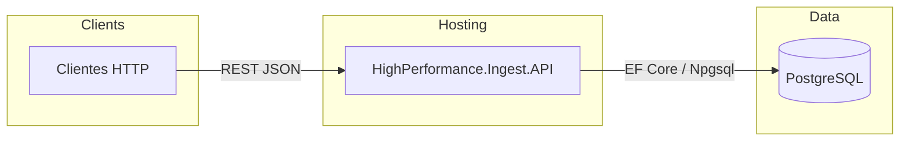
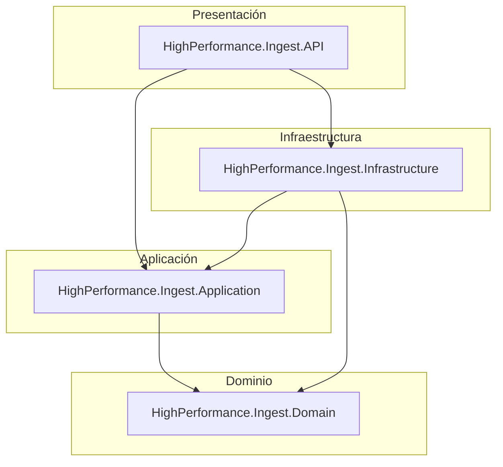
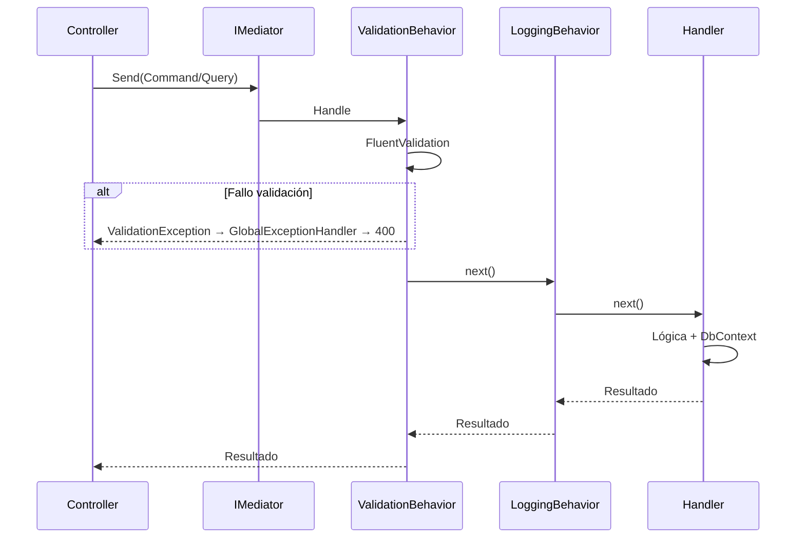
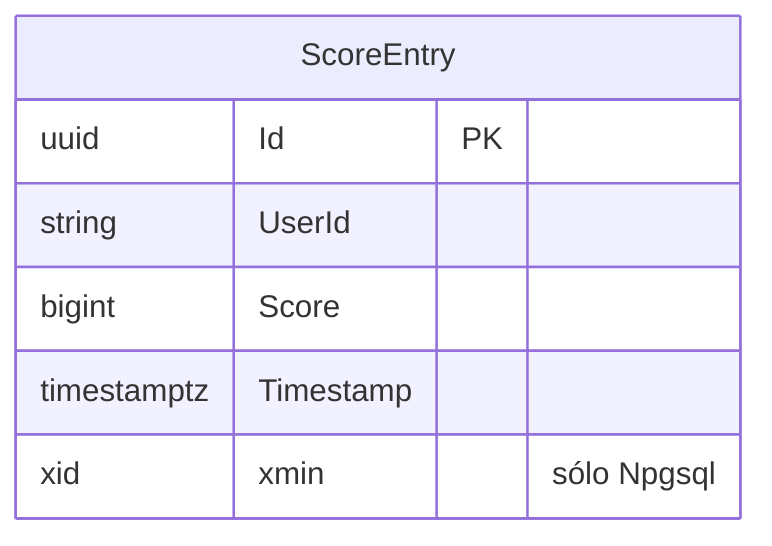
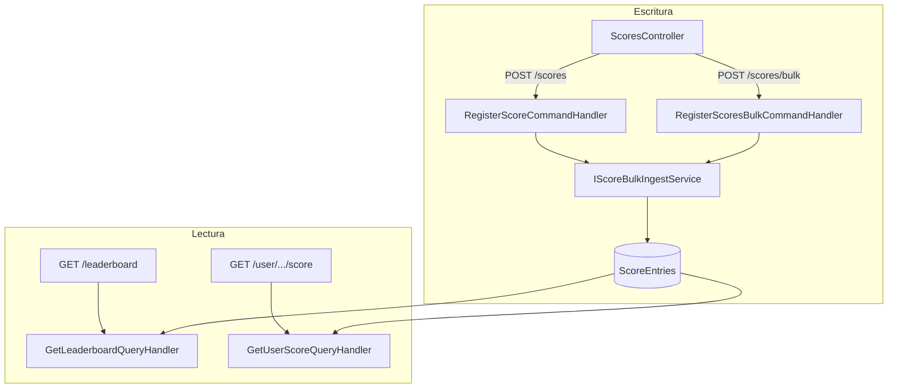
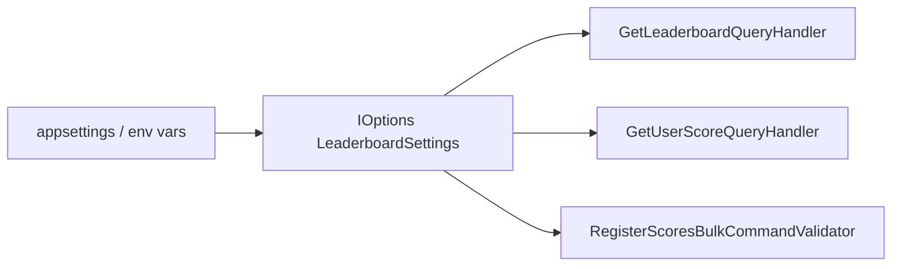
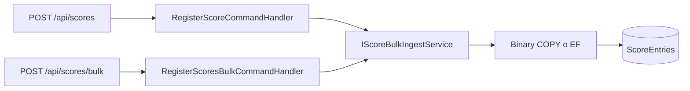
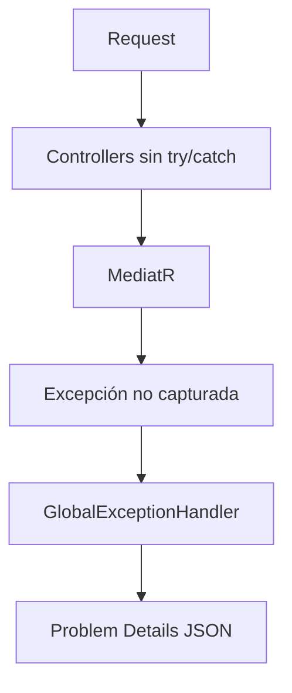

# Arquitectura y diseño de la solución

Este documento describe la estructura de **HighPerformance.Ingest**: capas, patrones (CQRS + MediatR), integración con **EF Core** y **PostgreSQL**, el servicio de **leaderboard** append-only, y el manejo transversal de validación y errores.

---

## 1. Contexto del sistema

La solución expone una **Web API** (.NET 10) orientada a:

- **Leaderboard global**: registro de puntuaciones con **`IScoreBulkIngestService`**: **`POST /api/scores`** (una fila) y **`POST /api/scores/bulk`** (varias filas). En PostgreSQL usa **`Npgsql` binary COPY** sobre `ScoreEntries`; en otros proveedores (p. ej. SQLite en tests) hace `Add` + `SaveChanges`.
- **Lecturas**: agregación por ventana de tiempo configurable (`GetLeaderboard` / `GetUserScore`).

---

## 2. Estructura de capas (Clean Architecture)

Las dependencias apuntan **hacia dentro**: el dominio no conoce infraestructura ni ASP.NET.

| Proyecto | Responsabilidad |
|----------|-----------------|
| **API** | `Program.cs`, controladores finos, `IExceptionHandler`, Swagger, configuración DI de arranque. |
| **Application** | Comandos/consultas MediatR, DTOs, FluentValidation, pipeline behaviors (`Logging`, `Validation`), `IApplicationDbContext`, `IScoreBulkIngestService`, configuración tipada (`LeaderboardSettings`). |
| **Domain** | Entidades puras: `ScoreEntry` (sin dependencias de EF). |
| **Infrastructure** | `AppDbContext`, migraciones, `ScoreBulkIngestService` (COPY hacia `ScoreEntries` vía comandos de registro), registro Npgsql. |

---

## 3. CQRS y pipeline de MediatR

Los casos de uso se modelan como **comandos** (escritura) y **consultas** (lectura). MediatR los despacha a handlers registrados por ensamblado.

### Comandos y consultas principales

| Tipo | Ejemplo | Handler |
|------|---------|---------|
| Comando | `RegisterScoreCommand` | `RegisterScoreCommandHandler` → `IScoreBulkIngestService` (COPY en Npgsql; EF en tests) |
| Comando | `RegisterScoresBulkCommand` | `RegisterScoresBulkCommandHandler` → mismo `IScoreBulkIngestService` (un batch por petición HTTP) |
| Consulta | `GetLeaderboardQuery` | `SUM` / `GROUP BY` con filtro por ventana |
| Consulta | `GetUserScoreQuery` | Agregación filtrada por `UserId` |

---

## 4. Modelo de datos (persistencia)

EF Core mapea entidades a tablas. En **PostgreSQL**, la propiedad `Version` se enlaza a **`xmin`** como token de concurrencia; en otros proveedores (p. ej. SQLite en tests) se omite.

Índice relevante para el leaderboard: **`IX_ScoreEntries_UserId_Timestamp`** para acelerar filtros por usuario y por ventana temporal.

---

## 5. Flujos por dominio funcional

### 5.1 Leaderboard (append-only + agregación en lectura)

Cada `POST /api/scores` inserta una fila nueva; **`POST /api/scores/bulk`** inserta N filas en el mismo camino de persistencia. No se actualiza un contador por usuario en caliente en la misma fila, lo que reduce **contención por hot key** en escritura.

Ventana de tiempo: **`LeaderboardSettings:WindowDays`** (p. ej. 7 días). Tamaño máximo del lote HTTP bulk: **`LeaderboardSettings:MaxScoreBatchSize`**. Ambas se inyectan con `IOptions<LeaderboardSettings>` (lecturas y validación del comando bulk).

### 5.2 Ingesta masiva de scores (`IScoreBulkIngestService`)

Los flujos **`POST /api/scores`** (`RegisterScoreCommand`) y **`POST /api/scores/bulk`** (`RegisterScoresBulkCommand`) persisten filas en `ScoreEntries` a través del mismo **`IScoreBulkIngestService`**. En PostgreSQL, **`ScoreBulkIngestService`** usa **`Npgsql.BinaryImport`** (`COPY ... BINARY`) para evitar el change tracker de EF en el camino caliente. Con SQLite (tests unitarios/E2E) cae a **`Add` + `SaveChanges`** sobre el mismo `DbContext`.

El bulk HTTP valida que el array `entries` no esté vacío, que cada ítem cumpla las mismas reglas que un score único (`UserId`, `Score >= 0`), y que **`entries.Count <= MaxScoreBatchSize`**.

Regla temporal explícita: cuando `Timestamp` se envía, debe incluir zona horaria (ISO-8601 UTC o con offset). Timestamps sin zona (`Unspecified`) se rechazan en validación. En ambos handlers de escritura, el valor se normaliza a UTC antes de persistir.

---

## 6. Manejo de errores y API

- **`IExceptionHandler`** (`GlobalExceptionHandler`): respuestas **Problem Details**.
- **`DbUpdateConcurrencyException`** → **409** (p. ej. conflicto con `xmin`).
- **`ValidationException` (FluentValidation)** → **400**.
- Otras excepciones → **500**.

Controladores **delgados**: solo construyen el mensaje y delegan en `IMediator`.

---

## 7. Relación con despliegue y tests

- **Producción / local**: PostgreSQL + migraciones EF bajo `Infrastructure/Persistence/Migrations`.
- **Tests**: handlers con SQLite en memoria; E2E con `WebApplicationFactory` sustituyendo el `DbContext` por SQLite para evitar doble proveedor en DI.
- **Docker Compose local** (`deploy/docker-compose.yml`):
  - `postgres` (PostgreSQL 16, puerto `5432`) como base por defecto para la API.
  - `api` (puerto `8080`) conectada al hostname interno `postgres` y con settings de leaderboard por variables de entorno.
  - Perfil opcional `goskaler` con `postgres_goskaler` (puerto `5433`) para una segunda instancia aislada con credenciales dedicadas.
  - El compose **no aplica migraciones automáticamente**; se ejecutan con `dotnet ef database update` antes del primer uso.

Snippets de contenedor e infra mínima: carpeta [`../deploy/`](../deploy/).

---

## 8. Resumen de decisiones de diseño

| Decisión | Motivo |
|----------|--------|
| CQRS + MediatR | Separa comandos y consultas; prueba y evolución por caso de uso. |
| Pipeline behaviors | Validación y logging centralizados sin repetir en controladores. |
| `xmin` en PostgreSQL | Token de concurrencia en `ScoreEntry` (útil si se amplían actualizaciones vía EF). |
| Leaderboard append-only | Menos contención en escrituras concurrentes al mismo `UserId`. |
| Agregación en query | Leaderboard *near-real-time* al costo de consultas `SUM`/`GROUP BY` (mitigable con caché en producción, ver `SOLUTION.md`). |

---

## 9. Cómo ver los diagramas

- **GitHub / GitLab**: vista previa Markdown con Mermaid.
- **VS Code**: extensiones “Markdown Preview Mermaid Support” o similares.
- **Cursor**: vista previa del archivo Markdown habitualmente renderiza bloques `mermaid`.
